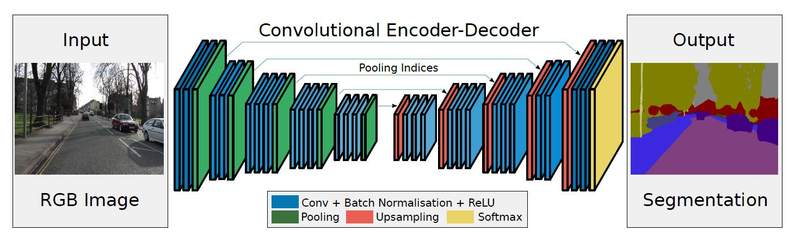
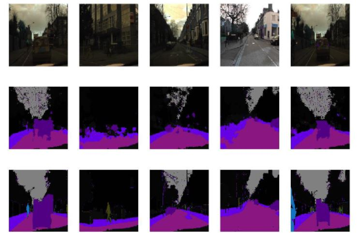

# SegNet-Semantic-Segmentation

Implementing:  https://arxiv.org/pdf/1511.00561.pdf

# Prerequisite:
* Tensorflow 2.0
* Numpy
* Keras
* Pandas

# Dataset:
* CamVid dataset, which contains real time scenes and their annotated images.

# Architecture:

There are no fully connected layers and hence it is only convolutional. A decoder upsamples its
input using the transferred pool indices from its encoder to produce a sparse feature map(s). It then performs convolution with a trainable filter bank to densify the feature map. The final decoder output feature maps are fed to a soft-max classifier for pixel-wise classification.

# Result:

